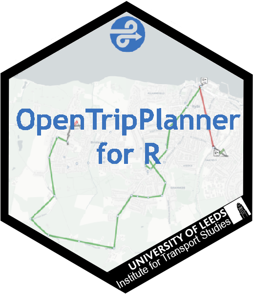

```{r setup, include=FALSE}
knitr::opts_chunk$set(echo = TRUE)
```

This is the central place to find package, code, and courses developed by the [Insitute for Transport Studies](https://environment.leeds.ac.uk/transport) at the [University of Leeds](https://www.leeds.ac.uk/), UK.

## R Packages / Software

### [cyclestreets: Cycle Routing and Data for Cycling Advocacy](https://cran.r-project.org/web/packages/cyclestreets/index.html)

An interface to the cycle routing/data services provided by 'CycleStreets', a not-for-profit social enterprise and advocacy organisation. The application programming interfaces (APIs) provided by 'CycleStreets' are documented at (<https://www.cyclestreets.net/api/>). The focus of this package is the journey planning API, which aims to emulate the routes taken by a knowledgeable cyclist. An innovative feature of the routing service of its provision of fastest, quietest and balanced profiles. These represent routes taken to minimise time, avoid traffic and compromise between the two, respectively.

### [OpenTripPlanner for R](https://itsleeds.github.io/opentripplanner/) <a href='https://itsleeds.github.io/opentripplanner/'></a>

[](https://travis-ci.org/ITSLeeds/opentripplanner) 
[](https://codecov.io/github/ITSLeeds/opentripplanner?branch=master) 
[](https://ci.appveyor.com/project/layik/opentripplanner-05ana) [](https://www.repostatus.org/#active)

The goal of OpenTripPlanner for R is to provide a simple R interface to [OpenTripPlanner (OTP)](https://www.opentripplanner.org/). The OTP is a multimodal trip planning service written in Java. This R package makes it easy to setup OTP and get OTP's results into R.

### [pct](https://github.com/ITSLeeds/pct)

<!-- [](http://www.r-pkg.org/pkg/pct) -->
[](https://codecov.io/github/ITSLeeds/pct?branch=master) 
[](https://travis-ci.org/ITSLeeds/pct)

The goal of pct is to increase the accessibility and reproducibility of the data produced by the Propensity to Cycle Tool (PCT), a research project and web application hosted at [www.pct.bike](https://www.pct.bike/).
For an overview of the data provided by the PCT, clicking on the previous link and trying it out is a great place to start.
An academic [paper](https://www.jtlu.org/index.php/jtlu/article/view/862) on the PCT provides detail on the motivations for and methods underlying the project.


### [stats19](https://docs.ropensci.org/stats19/)

<!-- [](http://www.r-pkg.org/pkg/stats19) -->
[](https://travis-ci.org/ropensci/stats19)
[](https://codecov.io/gh/ropensci/stats19)
<!-- [](http://www.r-pkg.org/pkg/stats19) -->
<!-- [](https://www.tidyverse.org/lifecycle/) -->
[](https://github.com/ropensci/onboarding/issues/266)
[](https://doi.org/10.21105/joss.01181)

stats19 provides functions for downloading and formatting road crash data. Specifically, it enables access to the UK’s official road traffic casualty database, STATS19. (The name comes from the form used by the police to record car crashes and other incidents resulting in casualties on the roads.)

### [stplanr](https://docs.ropensci.org/stplanr/) <a href='https://docs.ropensci.org/stplanr/'></a>

[](https://travis-ci.org/ropensci/stplanr)
<!-- [](https://github.com/metacran/cranlogs.app) -->
<!-- [](https://cran.r-project.org/package=stplanr) -->
<!-- [](https://cran.r-project.org/package=stplanr) -->
<!-- [](https://www.tidyverse.org/lifecycle/#maturing) -->
[](https://github.com/ropensci/onboarding/issues/10)

stplanr is a package for sustainable transport planning with R. It provides functions for solving common problems in transport planning and modelling, such as how to best get from point A to point B. The overall aim is to provide a reproducible, transparent and accessible toolkit to help people better understand transport systems and inform policy, as outlined in a [paper](https://journal.r-project.org/archive/2018/RJ-2018-053/index.html) about the package, and the potential for open source software in transport planning in general.


## ITS Courses

### [Go: Easy set up for R courses from ITS](https://github.com/ITSLeeds/go)  <a href='https://github.com/ITSLeeds/go'></a>

This Repo contains code that helps set up your computer and R session for ITS Courses or to use ITS developed R packages.

